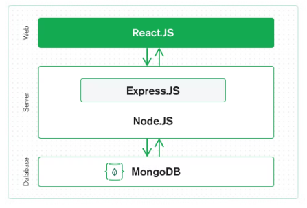

### ReadMe

## Feature specification

The project aims to be a ecommerce web application that generates different designs of products using AI. Users will generate images by text prompts and will get offers of different products with the generated image displayed on them, for example a t-shirt.

# Image generator
- Connected to the API of the image generator DALL E 2 by OpenAI
- the input from the user will be text describing desired image
- Possibility for image altering where users gives the input of text and an image
- Multiple altenatives will be generated at once. Users can select one or regenerate

# Product visualisation (After selected image)
- Different products will automatically be visualised with the generated image placed on them
- Will be the same no matter what the picture is

# General functionality
- Shoppingcart
- checkout
- Login/register/logout
- Authentication
- Save images to profile for possible future purchase
- Inspiration of other generated images and help on how to write good prompts
- payment
- Order notification to owner

## Technical specification

The project will be made as an MERN stack (MongoDB, Express, React & Node)

The archtiecture will be a three-tier architecture with front end, back end & database. 

React will work as the web front end tool and allow dynamic applications and work by making components.

Express and Node will be the server where express is a “fast, unopinionated, minimalist web framework for Node.js,” 

MongoDB cloud database will be used to store data and is very easy to work with using MongoDBCompass

The reasoning behind the technological design choices are thet they will be able to do what the features requires and due to my previous expreience working with it.



## How To Run
Create an Atlas URI connection parameter in `mern/server/config.env` with your Atlas URI:
```
ATLAS_URI=mongodb+srv://<username>:<password>@sandbox.jadwj.mongodb.net/myFirstDatabase?retryWrites=true&w=majority
PORT=5000
```

Start server:
```
cd mern/server
npm install
npm start
```

Start Web server
```
cd mern/client
npm install
npm start
```
